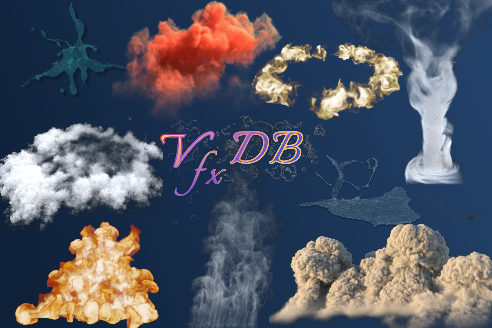

# VfxDB

Official repository for the VfxDB paper:

**VfxDB: A Visual Effects Volume Dataset and Benchmark for VDB-Native Generative Modeling**



This repository contains the project website assets and the minimal Hugging Face diffusers training, inference, and validation path extracted from `vgrad_train`.

## Install

```bash
pip install -r requirements-core.txt
```

For CUDA, install the matching PyTorch wheel for your machine first, then install the remaining requirements. The public `.vdb` data requires the separately released `vdb_ext` extension to be built or installed in the same Python environment.

`vdb_ext` must be built against compatible OpenVDB/NanoVDB/Boost/TBB libraries, and those shared libraries must be visible at runtime, for example through `LD_LIBRARY_PATH` or the system loader cache.

The download helpers use the Hugging Face `hf` CLI and `tar`; extracting the metadata archive also requires `zstd`.

## Dummy Smoke Test

```bash
python tools/make_dummy_vdbset.py --out dummy_data/vdbset --num-categories 2 --num-sequences 2 --num-frames 4 --size 8
python train_one_stage.py --config configs/train_dummy_static.yaml
python tests/test_pipeline_parity.py
python infer_one_stage_hf.py --config configs/infer_one_stage_hf.yaml --ckpt runs/dummy_static/one_stage_dummy_static/ckpt/step_000002 --out-dir results/dummy_infer
```

The production training wrappers are in `sh/`. They assume you run from this folder.

## Milestone Correspondence

The paper/milestone training entry was:

```bash
python train_one_stage.py --config configs/conditional_temporal_32_baseline_5ws.yaml
```

The open-source release exposes the three baseline settings:

```bash
./sh/run_train_cond_static_32.sh --data-root /path/to/VDBSet
./sh/run_train_cond_temporal_32.sh --data-root /path/to/VDBSet
./sh/run_train_uncond_static_32.sh --data-root /path/to/VDBSet
```

The older wrapper names are still available as aliases:

```bash
./sh/run_train_one_stage_acc.sh --data-root /path/to/VDBSet
./sh/run_train_one_stage.sh --data-root /path/to/VDBSet
```

The `acc` suffix is kept from the original `vgrad_train/sh/run_train_one_stage_acc.sh` entrypoint; it is the accelerate-based static baseline launcher.

Both configs retain the paper-line one-stage settings such as class conditioning, occupancy head, EMA, `log1p` value space, DDPM schedule, P2 weighting, and temporal previous-frame conditioning for the temporal model.

## Dataset Layout

Training expects a root like:

```text
root/
  dataset_index.json
  CategoryA/
    category_index.json
    seq000/
      sample__n0000.npz
      sample__n0000.json
```

Each `.npz` file must contain `vol` with shape `[D, H, W]`. Optional `occ`, `leaf_base`, and `lvl_sizes` keys are supported.

## 1000 VDB Example

This downloads indexes, selected data archives, and metadata for a small CloudWave run:

```bash
python tools/download_extract_data.py \
  --data-root data/vdbset \
  --categories CloudWave \
  --max-samples-per-category 1000
```

With a local proxy:

```bash
python tools/download_extract_data.py \
  --data-root data/vdbset \
  --categories CloudWave \
  --max-samples-per-category 1000 \
  --proxy http://127.0.0.1:7890
```

The downloader selects the folder tar archives needed by the first indexed samples. For CloudWave at 1000 samples, this currently selects 9 archives under `archives/CloudWave/`.

After `vdb_ext` is installed, run a short conditional static training job:

```bash
./sh/run_train_cond_static_32.sh \
  --data-root data/vdbset \
  --categories "[CloudWave]" \
  --max-train-samples 1000
```

## Metadata Archive

Current training does not require metadata JSON files by default. To reproduce legacy meta-gated runs, extract the metadata archive from the Hugging Face dataset repository into the same VDBSet root:

```bash
python tools/download_extract_meta.py --data-root /path/to/VDBSet
```

With a local proxy:

```bash
python tools/download_extract_meta.py --data-root /path/to/VDBSet --proxy http://127.0.0.1:7890
```

With an already downloaded archive:

```bash
python tools/download_extract_meta.py --archive /path/to/vfxdb_meta.tar.zst --data-root /path/to/VDBSet
```

The default remote archive path is `meta/vfxdb_meta.tar.zst` in `ryogishiki/VfxDB`. The extractor validates archive paths and rejects temporary rename paths by default.
